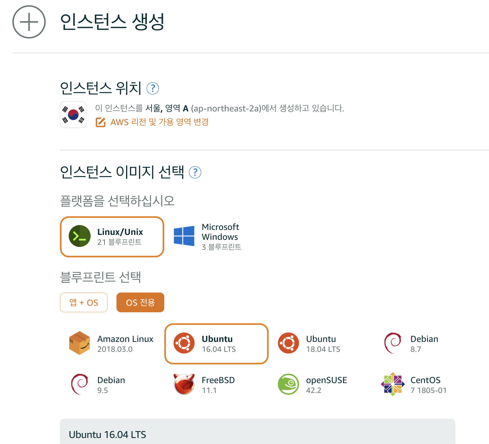
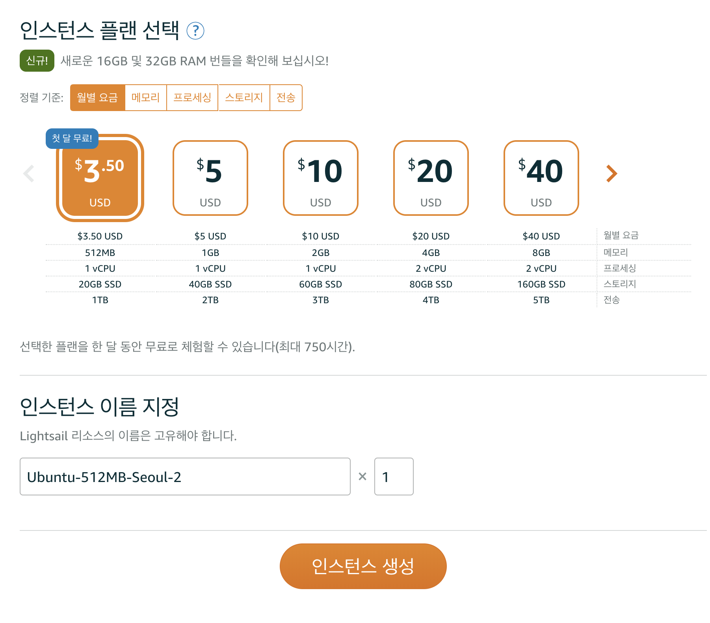
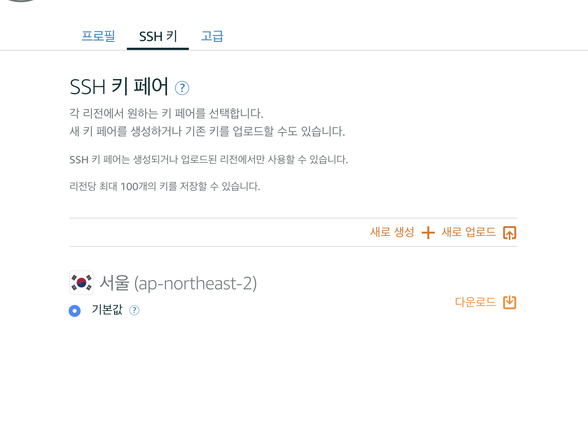

# Linux Server Configuration

> This is the final project for Udacity's [Full Stack Web Developer Nanodegree](https://www.udacity.com/course/full-stack-web-developer-nanodegree--nd004)

#### Objective

You will take a baseline installation of a Linux distribution on a virtual machine and prepare it to host your web applications, to include installing updates, securing it from a number of attack vectors and installing/configuring web and database servers.

#### Description

This page explains how to secure and set up a Linux distribution on a virtual machine, install and configure a web and database server to host a web application.

-   The Linux distribution is [Ubuntu](https://www.ubuntu.com/download/server) 16.04 LTS.
-   The virtual private server is [Amazon Lighsail](https://lightsail.aws.amazon.com/).
-   The web application is my [Item Catalog project](https://github.com/reck1ess/item-catalog) created earlier in this Nanodegree program.
-   The database server is [PostgreSQL](https://www.postgresql.org/).
-   My local machine is a MacBook Pro (macOS Mojave 10.14.1)
-   Public IP Address: 13.209.11.93
-   URL: [http://ec2-13-209-11-93.ap-northeast-2.compute.amazonaws.com](http://ec2-13-209-11-93.ap-northeast-2.compute.amazonaws.com)
-   Accessible SSH port: 2200

**※ Please visit [http://ec2-13-209-11-93.ap-northeast-2.compute.amazonaws.com](http://ec2-13-209-11-93.ap-northeast-2.compute.amazonaws.com) for testing.**

> You cannot login with Google account at http://13.125.200.246 because of Google's public-suffixes-and-private-domains policy

# TL;DR;

```sh
ssh -i ~/.ssh/grader_key -p 2200 grader@13.209.11.93
```

Visit [http://ec2-13-209-11-93.ap-northeast-2.compute.amazonaws.com](http://ec2-13-209-11-93.ap-northeast-2.compute.amazonaws.com) for testing. 😎

---

## Build a server 👨‍💻

### Step 1: Start a new Ubuntu Linux server instance on Amazon Lightsail




-   [Amazon Lightsail](https://lightsail.aws.amazon.com/ls/webapp/home/resources) using an Amazon Web Services account.
-   `Create instance`.
-   Choose `Linux/Unix` platform, `OS Only` and `Ubuntu 16.04 LTS`.
-   Choose a `the cheapest plan`.
-   Click the `Create` button to create the instance.

### Step 2: SSH into the server



-   From the `Account` menu on Amazon Lightsail, click on `SSH keys` tab and download the Default Private Key.
-   Move this private key file named `LightsailDefaultPrivateKey-*.pem` into the local folder `~/.ssh` and rename it `lightsail_key.rsa`.

```sh
chmod 600 ~/.ssh/lightsail_key.rsa
ssh -i ~/.ssh/lightsail_key.rsa ubuntu@13.209.11.93
```
